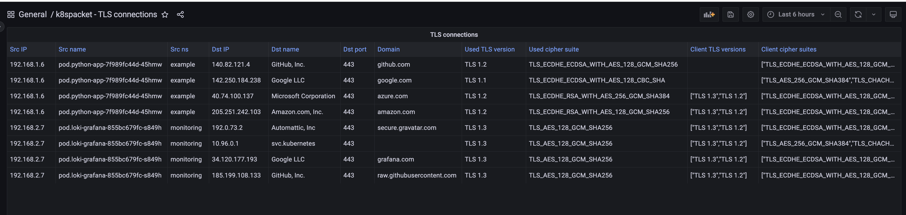
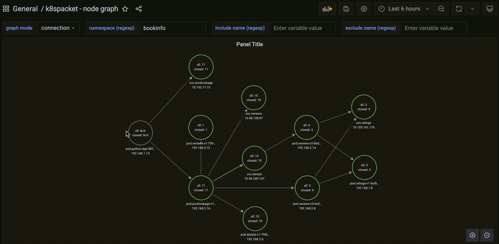
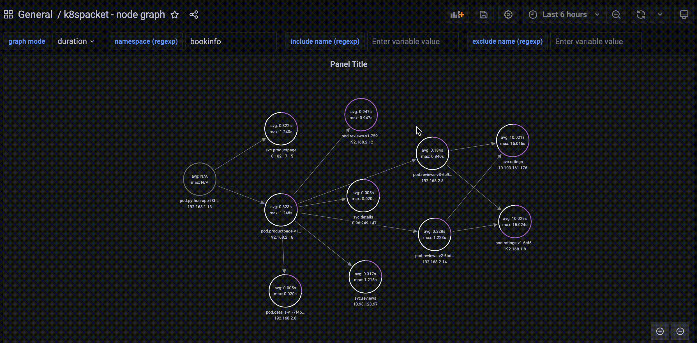

# k8spacket - packets traffic visualization for kubernetes 

<p align="center">
<a href="https://killercoda.com/k8spacket/scenario/k8spacket" target=”_blank”></a>
</p>

## What's new in version 2.0.0

`k8spacket` doesn't use the `gopacket` library nowadays and is fully based on  now!\
Read the article on medium.com *[k8spacket — a fully based on eBPF right now](https://medium.com/@bareckidarek/k8spacket-a-fully-based-on-ebpf-right-now-e72d5383c743)*

It uses
- `inet_sock_set_state` tracepoint to get information about TCP connections inside the cluster
- traffic control and queueing discipline filters on ingress and egress to collect information about TLS handshake process 

To use `k8spacket v2.x.x`, the minimum required kernel version is **5.8**

New features:
- Dashboard `k8spacket - TLS certificate expiration` shows the remaining time until the certificates expire. By variable `Past interval to analyze`, you can narrow or expand the scope of data to analyze. Data sorted by expiring earliest first. It's easy to build alerts based on the certificate expiration date. See more raw metrics in the dashboard `k8spacket - TLS metrics`


- Two principal `k8spacket` dashboards (`k8spacket - node graph` and `k8spacket - TLS connections & certificates`) are sensitive to Grafana time range control now. You can show cluster TCP traffic or TLS connections, f.e., for the last 5 minutes


---


---
## What's new in version 1.1.0

- `tls-parser` plugin can get information about the server certificate chain (TLS versions less than 1.3)
- dashboard about TLS connections has changed to show server certificate chain details (depends on `marcusolsson-json-datasource` and `marcusolsson-dynamictext-panel` Grafana plugins)


---
## What's new in version 1.0.0

- architecture of k8spacket changed to use `go plugins` (see available plugins here: https://github.com/k8spacket/plugins)
- added the plugin with metrics about the TLS handshake process inside and outside the cluster (TLS version and cipher suite used)
- added a dashboard with TLS metrics


- added a dashboard about TLS connections
  - IP and name of TLS client
  - domain, IP, and port of TLS server
  - supported TLS versions and cipher suites by the client
  - chosen TLS version and cipher suite by the server



---

`k8spacket` helps to understand TCP packets traffic in your kubernetes cluster:

- shows traffic between workloads in the cluster
- informs where the traffic is routed outside the cluster
- displays information about closing sockets by connections
- shows how many bytes are sent/received by workloads
- calculates how long the connections are established
- displays the net of connections between workloads in the whole cluster

`k8spacket` uses Node Graph API Grafana datasource plugin. See details [Node Graph API plugin](https://grafana.com/grafana/plugins/hamedkarbasi93-nodegraphapi-datasource)

## Installation

Install `k8spacket` using helm chart (https://github.com/k8spacket/k8spacket-helm-chart)

```bash
  helm repo add k8spacket https://k8spacket.github.io/k8spacket-helm-chart
  helm repo update
  
  helm install k8spacket --namespace k8spacket k8spacket/k8spacket --create-namespace
```

Add `Node Graph API` and `JSON API` plugins and datasources to your Grafana instance. You can do it manually or change helm values for the Grafana chart, e.g.:
```yaml

grafana:
  env:
    GF_INSTALL_PLUGINS: hamedkarbasi93-nodegraphapi-datasource,marcusolsson-json-datasource,marcusolsson-dynamictext-panel
  datasources:
    nodegraphapi-plugin-datasource.yaml:
      apiVersion: 1
      datasources:
        - name: "Node Graph API"
          jsonData:
            url: "http://k8spacket.k8spacket.svc.cluster.local:8080/nodegraph"
          access: "proxy"
          basicAuth: false
          isDefault: false
          readOnly: false
          type: "hamedkarbasi93-nodegraphapi-datasource"
          typeLogoUrl: "public/plugins/hamedkarbasi93-nodegraphapi-datasource/img/logo.svg"
          typeName: "node-graph-plugin"
          orgId: 1
          version: 1
    marcusolsson-json-datasource.yaml:
      apiVersion: 1
      datasources:
        - name: "JSON API"
          url: "http://k8spacket.k8spacket.svc.cluster.local:8080/tlsparser/api/data"
          access: "proxy"
          basicAuth: false
          isDefault: false
          readOnly: false
          type: "marcusolsson-json-datasource"
          typeLogoUrl: "public/plugins/marcusolsson-json-datasource/img/logo.svg"
          typeName: "json-api-plugin"
          orgId: 1
          version: 1
```

Fill [additional scrape config](https://prometheus.io/docs/prometheus/latest/configuration/configuration/#scrape_config) to observe Prometheus metrics:
```yaml
    - job_name: "k8spacket-metrics"
      metrics_path: /metrics
      scrape_interval: 25s
      static_configs:
      - targets: [k8spacket.k8spacket.svc.cluster.local:8080]
```

Add dashboards configmap to Grafana stack

```bash
  kubectl -n $GRAFANA_NS apply --recursive -f ./dashboards
```

## Usage

Go to `k8spacket - node graph` in Grafana Dashboards and use filters as below

### Select graph mode (connection, bytes, duration)



### Filter by namespace


### Filter by include or exclude workflow name



