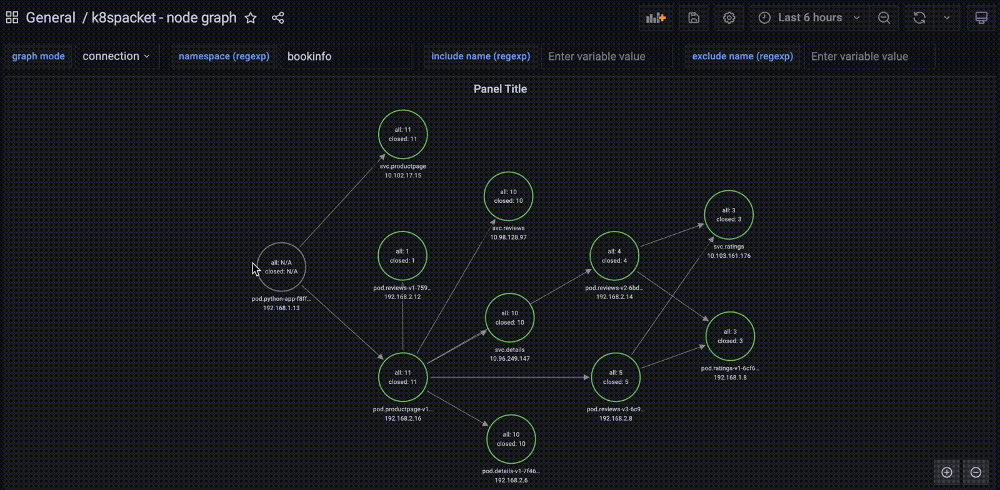

# k8spacket - packets traffic visualization for kubernetes

---
## What's new in version 1.0.0

- architecture of k8spacket changed to support `go plugins` (see available plugins here: https://github.com/k8spacket/plugins)
- added plugin with metrics about the TLS handshake process inside and outside the cluster (TLS version and cipher suite used)
- added dashboard with TLS metrics


- added a dashboard about TLS connections
  - IP and name of TLS client
  - domain, IP, and port of TLS server
  - supported TLS versions and cipher suites by the client
  - chosen TLS version and cipher suite by the server


---

`k8spacket` helps to understand TCP packets traffic in your kubernetes cluster:

- shows traffic between workloads in the cluster
- informs where the traffic is routed outside the cluster
- displays information about closing sockets by connections
- shows how many bytes are sent/received by workloads
- calculates how long the connections are established
- displays the net of connections between workloads in the whole cluster

`k8spacket` uses Node Graph API Grafana datasource plugin. See details [Node Graph API plugin](https://grafana.com/grafana/plugins/hamedkarbasi93-nodegraphapi-datasource)

## Installation

Install `k8spacket` using helm chart (https://github.com/k8spacket/k8spacket-helm-chart)

```bash
  helm repo add k8spacket-alpha https://k8spacket.github.io/k8spacket-helm-chart/alpha
  helm install k8spacket --namespace k8spacket k8spacket-alpha/k8spacket --version 1.0.0-alpha --create-namespace
```

Add the `Node Graph API` plugin and datasource to your Grafana instance. You can do it manually or change helm values for the Grafana chart, e.g.:
```yaml
grafana:
  env:
    GF_INSTALL_PLUGINS: hamedkarbasi93-nodegraphapi-datasource
  datasources:
    nodegraphapi-plugin-datasource.yaml:
      apiVersion: 1
      datasources:
      - name: "Node Graph API"
        jsonData:
          url: "http://k8spacket.k8spacket.svc.cluster.local:8080/nodegraph"
        access: "proxy"
        basicAuth: false
        isDefault: false
        readOnly: false
        type: "hamedkarbasi93-nodegraphapi-datasource"
        typeLogoUrl: "public/plugins/hamedkarbasi93-nodegraphapi-datasource/img/logo.svg"
        typeName: "node-graph-plugin"
        orgId: 1
        version: 1
```

Add dashboards configmap to Grafana stack

```bash
  kubectl -n $GRAFANA_NS apply --recursive -f ./dashboards
```

## Usage

Go to `k8spacket - node graph` in Grafana Dashboards and use filters as below

### Select graph mode (connection, bytes, duration)



### Filter by namespace


### Filter by include or exclude workflow name


