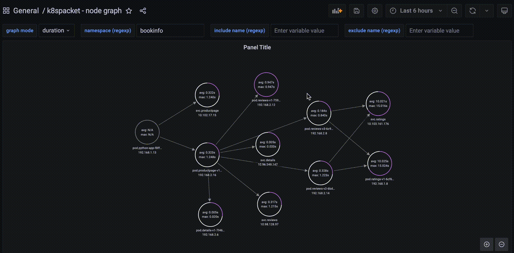

<p align="center">
    
</p>

# [k8spacket](https://github.com/k8spacket) - packets traffic visualization for kubernetes

## What's new in version 1.0.0

- architecture of k8spacket changed to use `go plugins` (see available plugins here: [https://github.com/k8spacket/plugins](https://github.com/k8spacket/plugins))
- added the plugin with metrics about the TLS handshake process inside and outside the cluster (TLS version and cipher suite used)
- added a dashboard with TLS metrics


- added a dashboard about TLS connections
    - IP and name of TLS client
    - domain, IP, and port of TLS server
    - supported TLS versions and cipher suites by the client
    - chosen TLS version and cipher suite by the server


---

`k8spacket` helps to understand TCP packets traffic in your kubernetes cluster:

- shows traffic between workloads in the cluster
- informs where the traffic is routed outside the cluster
- displays information about closing sockets by connections
- shows how many bytes are sent/received by workloads
- calculates how long the connections are established
- displays the net of connections between workloads in the whole cluster

`k8spacket` uses Node Graph API Grafana datasource plugin. See details [Node Graph API plugin](https://grafana.com/grafana/plugins/hamedkarbasi93-nodegraphapi-datasource)

## Installation

Install `k8spacket` using helm chart (https://github.com/k8spacket/k8spacket-helm-chart)

```bash
  helm repo add k8spacket https://k8spacket.github.io/k8spacket-helm-chart
  helm repo update k8spacket
  
  helm install k8spacket --namespace k8spacket k8spacket/k8spacket --create-namespace
```

Add `Node Graph API` and `JSON API` plugins and datasources to your Grafana instance. You can do it manually or change helm values for the Grafana chart, e.g.:
```yaml
grafana:
  env:
    GF_INSTALL_PLUGINS: hamedkarbasi93-nodegraphapi-datasource,marcusolsson-json-datasource
  datasources:
    nodegraphapi-plugin-datasource.yaml:
      apiVersion: 1
      datasources:
        - name: "Node Graph API"
          jsonData:
            url: "http://k8spacket.k8spacket.svc.cluster.local:8080/nodegraph"
          access: "proxy"
          basicAuth: false
          isDefault: false
          readOnly: false
          type: "hamedkarbasi93-nodegraphapi-datasource"
          typeLogoUrl: "public/plugins/hamedkarbasi93-nodegraphapi-datasource/img/logo.svg"
          typeName: "node-graph-plugin"
          orgId: 1
          version: 1
    marcusolsson-json-datasource.yaml:
      apiVersion: 1
      datasources:
        - name: "JSON API"
          url: "http://k8spacket.k8spacket.svc.cluster.local:8080/tlsparser/api/data"
          access: "proxy"
          basicAuth: false
          isDefault: false
          readOnly: false
          type: "marcusolsson-json-datasource"
          typeLogoUrl: "public/plugins/marcusolsson-json-datasource/img/logo.svg"
          typeName: "json-api-plugin"
          orgId: 1
          version: 1
```

Fill additional scrape config to observe Prometheus metrics (https://prometheus.io/docs/prometheus/latest/configuration/configuration/#scrape_config):
```yaml
    - job_name: "k8spacket-metrics"
      metrics_path: /metrics
      scrape_interval: 25s
      static_configs:
      - targets: [k8spacket.k8spacket.svc.cluster.local:8080]
```

Add dashboards configmap to Grafana stack

```bash
  kubectl -n $GRAFANA_NS apply --recursive -f ./dashboards
```

## Usage

Go to `k8spacket - node graph` in Grafana Dashboards and use filters as below

### Select graph mode (connection, bytes, duration)


### Filter by namespace


### Filter by include or exclude workflow name



